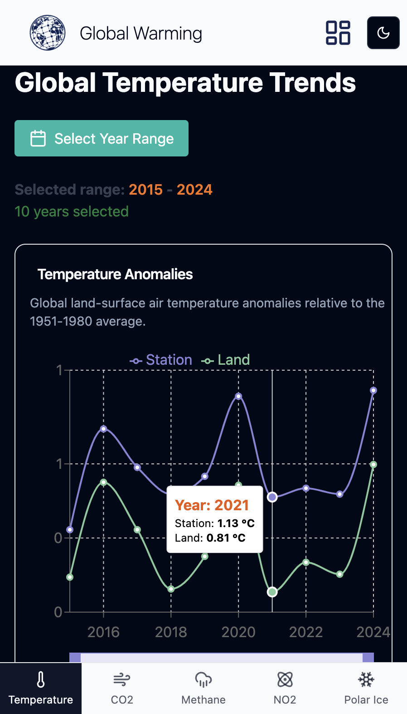

# Global Warming Tracker

Global Warming Tracker is a web application that provides an interactive overview of climate change data, displaying charts on various environmental indicators. You can explore Temperature, CO2, Methane, NO2, and Arctic Ice levels through easy-to-navigate visual charts.


## Technologies Used

-  A JavaScript library for building user interfaces.
-  A superset of JavaScript that adds type safety.
-  A high-performance build tool for the frontend.
-  A library for creating interactive charts.
-  A utility-first CSS framework for rapid and customizable styling.
-  A UI component library that provides beautiful, customizable, and accessible components for React, enabling faster development with a modern design.

## Project Structure

The app is built as a multi-page application with the following key sections:

- **<span style="color:#4CAF50;">Home Page</span>**: A central view where users can select the chart to display.
- **Pages**:
  - **<span style="color:#FF5722;">Temperature</span>**: Displays the temperature trend chart.
  - **<span style="color:#2196F3;">CO2</span>**: Displays the CO2 trend chart.
  - **<span style="color:#9C27B0;">Methane</span>**: Displays the methane trend chart.
  - **<span style="color:#FFEB3B;">NO2</span>**: Displays the NO2 trend chart.
  - **<span style="color:#03A9F4;">Arctic Ice</span>**: Displays the Arctic ice level trend chart.

<br>

<div align="center">

</div>

<br>

## Visit the climate change site

[Global Warming Track](https://global-warming-track.netlify.app/)

## Installation and Setup

### 1. Clone the Repository

Start by cloning the project to your local machine:

```bash
git clone https://github.com/your-username/global-warming-tracker.git
cd global-warming-tracker

2. Install Dependencies
Next, install the necessary dependencies using npm:

bash
Copia
Modifica
npm install

3. Start the Development Server
Once the dependencies are installed, you can start the development server:

bash
Copia
Modifica
npm run dev
The app will now be available at http://localhost:5173.


This section will help users get the project up and running on their local machine. Let me know if you need any additional tweaks!
```
